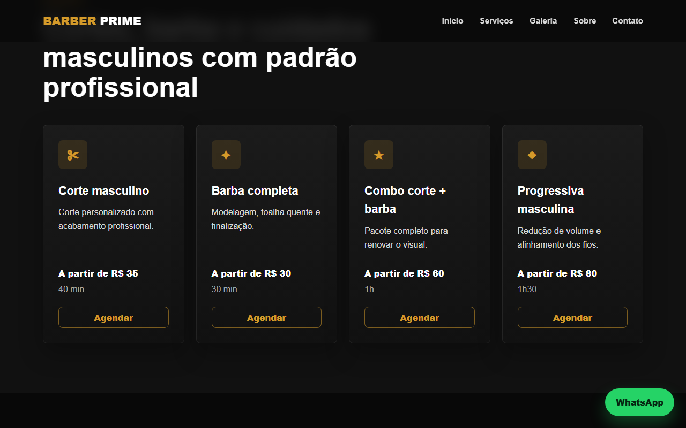
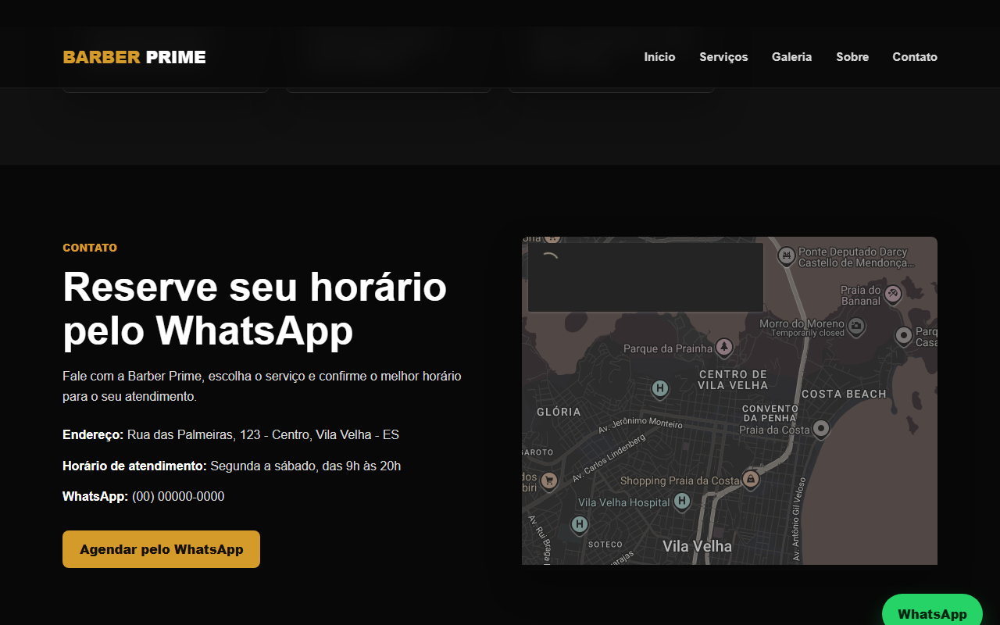

# Barber Prime

Landing page profissional para barbearia — demonstra a entrega típica para um pequeno negócio local que precisa de presença digital e geração de leads pelo WhatsApp.


## Demo

| | URL |
|---|---|
| **Site** | https://landing-barber-prime.vercel.app/ |

## Funcionalidades

- Hero com chamada comercial e CTA direto para WhatsApp
- Navbar fixa com menu responsivo e animação mobile
- Cards de serviços com preço, tempo estimado e botão de agendamento
- Galeria de imagens responsiva
- Seção institucional sobre a barbearia
- Depoimentos com avatares de iniciais
- Seção de contato com endereço, horário e mapa embutido
- Botão flutuante de WhatsApp visível em toda a página
- Ancoragem suave entre seções
- Meta description com cidade para SEO local

## Tecnologias

- HTML5, CSS3, JavaScript vanilla
- Google Maps Embed
- Deploy: Vercel

## Screenshots

### Hero — desktop


### Hero — mobile


### Serviços com preços


### Footer e contato


## Como rodar localmente

```bash
git clone https://github.com/RhanielRodri/landing-barber-prime.git
cd landing-barber-prime
```

Abra `index.html` diretamente no navegador. Sem dependências, sem build.

## O que este projeto demonstra

- **Layout orientado à conversão**: cada seção tem um CTA claro; o botão de WhatsApp permanece acessível em toda a rolagem
- **Menu mobile com JS puro**: animação de abertura/fechamento sem framework
- **SEO local**: meta description com cidade e região para indexação orgânica local
- **Google Maps Embed sem API paga**: iframe nativo com localização real
- **Design responsivo sem CSS framework**: breakpoints em CSS puro, mobile-first

## Autor

Desenvolvido por Rhaniel Rodrigues.

GitHub: https://github.com/RhanielRodri
